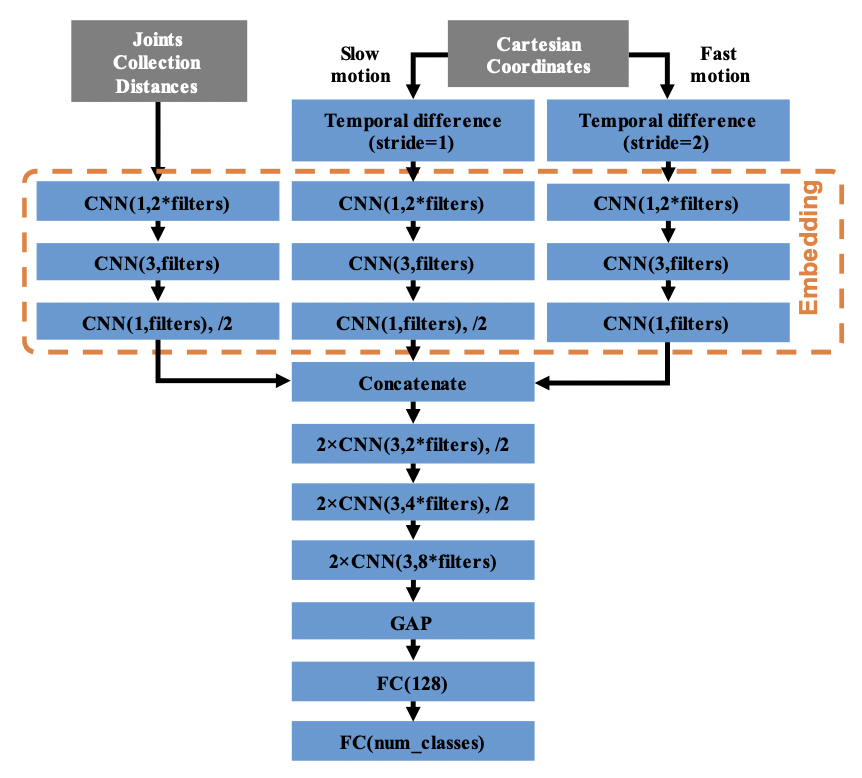

# DDNet
### *A Double-feature 🚀 Double-motion 🚀 Network*

This is an unofficial Tensorflow implementation of the [DDNet – Double-feature Double-motion Network](https://arxiv.org/pdf/1907.09658.pdf)

The authors of this repository believe, that this implementation is more readable and easier to understand than [the original one.](https://github.com/fandulu/DD-Net)

****
## Architecture
[](https://arxiv.org/pdf/1907.09658.pdf)
****

## Results 
Results on [SHREC](http://www-rech.telecom-lille.fr/shrec2017-hand/) dataset (using 3D skeletons)

| Methods | Parameters | 14 Gestures | 28 Gestures | Speed on GPU |
|---|---|---|---|---|
| Dynamic hand [19] (CVPRW16) | - | 88.2% | 81.9% | - |
| Key-frame CNN [4] (3DOR17) | 7.92 M | 82.9% | 71.9% | - |
| 3 Cent [21] (STAG17) | - | 77.9% | - | - |
| CNN+LSTM [38] (PR18) | 8-9 M | 89.8% | 86.3% | 238 FPS |
| Parallel CNN [5] (RFIAP18) | 13.83 M | 91.3% | 84.4% | - |
| STA-Res-TCN [6] (Gesture18) | 5-6 M | 93.6% | 90.7% | 303 FPS |
| MFA-Net [23] (Sensor19) | - | 91.3% | 86.6% | 361 FPS |
| DD-Net (filters=64, w/o global fast&slow motion) | 1.70 M | 55.2% | 41.6% | - |
| DD-Net (filters=64, w/o global slow motion) | 1.76 M | 92.7% | 90.2% | - |
| DD-Net (filters=64, w/o global fast motion) | 1.76 M | 93.3% | 90.5% | - |
| DD-Net (filters=64) | 1.82 M | 94.6% | 91.9% | 2,200 FPS |
| DD-Net (filters=32) | 0.50 M | 93.5% | 90.4% | 3,100 FPS |
| DD-Net (filters=16) | 0.15 M | 91.8% | 90.0% | 3,500 FPS |

****

## Data

JHMDB [](https://colab.research.google.com/drive/19gq3bUigdxIfyMCoWW93YhLEi1KQlBit)
SHREC-14 [](https://colab.research.google.com/drive/1jASRTHzsA03dZDC4yN29OK1G9L-l7jkP?usp=sharing)

```
JHMDB raw data download link:   http://jhmdb.is.tue.mpg.de/challenge/JHMDB/datasets
SHREC raw data download link:   http://www-rech.telecom-lille.fr/shrec2017-hand/
```

## Usage

This repository contains sources directory with implementation.

`sources/DDNet.py` - contains the actual model class

`sources/create_dataset.py` - script for creating a binary files with skeletons and labels (with pickle) from a
dataset that has a structure like [SHREC](http://www-rech.telecom-lille.fr/shrec2017-hand/). Note that you may need to
modify it if the structure of your dataset is different.

```
+---gesture_1 
|   +---finger_1 
|  |   +---subject_1 
|  |  |   +---essai_1 
|  |  |   |   
|  |  |   |   depth_0.png 
|  |  |   |   depth_1.png 
|  |  |   |   ... 
|  |  |   |   depth_N-1.png 
|  |  |   |   general_informations.txt 
|  |  |   |   skeletons_image.txt 
|  |  |   |   skeletons_world.txt 
|  |  |   | 
|  |  |   \---essai_2 
|  |  |   ... 
|  |  |   \---essai_5 
|  |   \---subject_2 
|  |   ... 
|  |   \---subject_20 
|   \---finger_2 
... 
\---gesture_14 

train_gestures.txt
test_gestures.txt
```

`souces/utils.py` - contains an important Config class with configurations for model training. There are also all
utilisation functions for the model training.

`sources/train.py` - script for training a model on a preprocessed dataset like
[SHREC](http://www-rech.telecom-lille.fr/shrec2017-hand/). Note that can modify this script to work with your own 
dataset.

## Citation
Please cite the original paper.
```
@inproceedings{yang2019ddnet,
  title={Make Skeleton-based Action Recognition Model Smaller, Faster and Better},
  author={Fan Yang, Sakriani Sakti, Yang Wu, and Satoshi Nakamura},
  booktitle={ACM International Conference on Multimedia in Asia},
  year={2019}
}
```